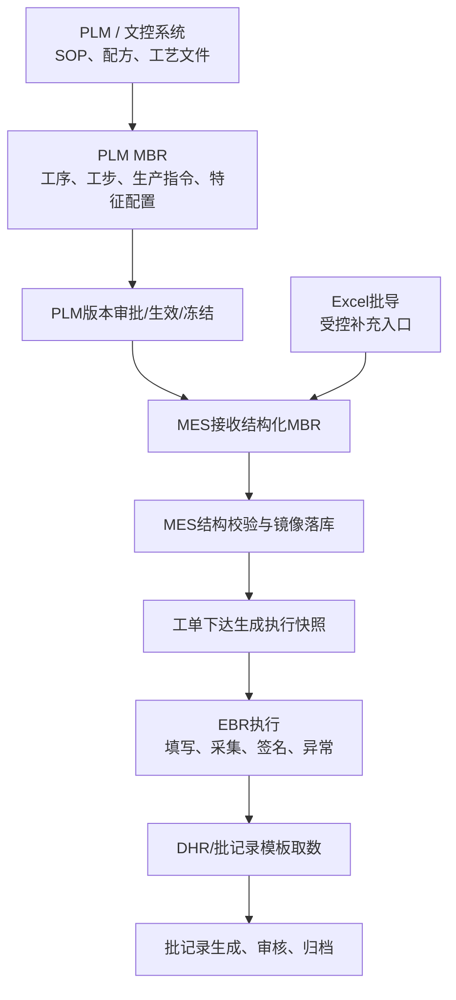

# PLM MBR接收与DHR模板取数业务口径

## 1. 总体边界

本口径用于明确 PLM、MES、EBR、DHR/批记录模板之间的职责边界。

核心原则：

- PLM 是 MBR 主系统，负责 SOP 拆解、MBR 设计、版本审批、生效、冻结和变更控制。
- MES 是 MBR 执行系统，负责接收已批准 MBR 镜像、生成工单执行快照、按工序工步执行并形成 EBR。
- DHR/批记录模板属于 MES 输出层，只负责从 EBR 和相关业务数据中取数、组装、渲染、归档，不反向驱动生产。
- Excel 批导是 PLM 暂不满足结构化接口时的受控补充入口，不是绕过 PLM 审批的手工通道。

## 2. 业务流程

## 3. PLM MBR 接收口径

### 3.1 PLM 下发内容

PLM 应向 MES 下发已批准的结构化 MBR，建议至少包含：

- PLM MBR ID
- MBR版本号
- 产品/物料编码
- 适用工厂/车间/产线/工作中心
- 生效日期
- 失效日期
- MBR状态
- 工序
- 工步
- 生产指令类型
- 特征配置
- 物料配置
- 设备/工装/夹具配置
- 质控项配置
- SOP/文档引用
- 电子签名/复核要求
- 异常/Hold/跳转规则

### 3.2 MES 接收职责

MES 接收后应做：

- 接收批次登记。
- 来源版本登记。
- 结构完整性校验。
- 引用对象校验。
- 字典项校验。
- 单位和精度校验。
- 物料、设备、工序、工作中心映射校验。
- 校验通过后写入 `pro_mbr_*` 镜像表。
- 校验失败时生成错误明细，不允许进入可执行状态。

### 3.3 MES 不做的事情

MES 不应承担：

- MBR主版本审批。
- MBR主版本发布。
- MBR主版本冻结。
- SOP文档生命周期管理。
- PLM ECN 审批。

MES 只执行 PLM 下发的已批准结果。

## 4. Excel 批导口径

Excel 批导适用于 PLM 暂时无法结构化输出 MBR 的过渡阶段。

Excel 批导必须满足：

- 有固定模板版本。
- 有上传人和上传时间。
- 有文件哈希。
- 有来源说明。
- 有校验结果。
- 有错误明细。
- 有导入状态。
- 有审计追踪。
- 不能直接绕过审批成为生产有效 MBR。

推荐状态：

- `UPLOADED`：已上传
- `VALIDATING`：校验中
- `VALIDATED`：校验通过
- `FAILED`：校验失败
- `IMPORTED`：已导入镜像表
- `CANCELLED`：已取消

## 5. 工单执行快照

工单创建或下达时，MES 必须基于当时有效的 PLM MBR 镜像生成执行快照。

执行快照应包含：

- 工单号
- 批次号
- PLM MBR ID
- MBR版本号
- MES MBR 镜像 ID
- Phase/Step 结构
- 参数规则
- 物料规则
- 设备规则
- 质控规则
- 签名规则
- 跳转/返工/Hold规则
- 快照哈希
- 快照生成时间

关键规则：

- EBR 执行引用执行快照，不实时读取 PLM。
- PLM 后续改版不影响已生成的执行快照，除非触发 Safe Hold 和上下文刷新。
- 执行快照是审计和追溯的关键证据。

## 6. DHR/批记录模板取数口径

DHR/批记录模板负责最终展示，不负责生产控制。

模板取数来源包括：

- EBR步骤记录
- EBR参数记录
- 称量记录
- 投料记录
- 检验结果
- SCADA采集摘要
- 环境/纯化水/冷链/CIP记录
- 异常偏差
- 电子签名
- 审计追踪
- 批次/序列号追溯
- 标签/UDI/包装记录

模板应支持：

- 产品维度配置。
- MBR版本维度配置。
- 批次/SN维度生成。
- 章节/目录树配置。
- 表格/字段映射。
- 数据聚合。
- 格式化。
- 附录挂载。
- 重生成版本留痕。
- PDF/文件归档。

## 7. 建议新增表

### 7.1 MBR 接收与导入控制表

| 表名 | 中文名称 | 用途 |
|---|---|---|
| `pro_mbr_import_batch` | MBR导入批次表 | 记录一次 PLM 接口接收或 Excel 批导任务 |
| `pro_mbr_import_item` | MBR导入明细表 | 记录导入对象明细和处理结果 |
| `pro_mbr_import_validate_log` | MBR导入校验日志表 | 记录完整性、合法性、引用关系和版本一致性校验 |
| `pro_mbr_import_error` | MBR导入错误明细表 | 记录字段缺失、字典非法、映射失败等错误 |
| `pro_mbr_source_file` | MBR来源文件表 | 保存 Excel 文件、文件哈希、上传人、上传时间和存储链接 |
| `pro_mbr_source_map` | PLM MBR来源映射表 | 映射 PLM MBR ID/版本与 MES 镜像 MBR ID/版本 |

### 7.2 DHR模板取数与渲染表

| 表名 | 中文名称 | 用途 |
|---|---|---|
| `pro_dhr_template` | 批记录模板表 | 定义 DHR/批记录模板主体、版本、状态和适用范围 |
| `pro_dhr_template_node` | 批记录模板节点表 | 定义模板目录、章节、表格、段落和附录 |
| `pro_dhr_data_source` | 批记录取数来源表 | 配置 EBR、检验、称量、采集、异常、签名等取数来源 |
| `pro_dhr_field_mapping` | 批记录字段映射表 | 配置模板字段与业务字段、聚合规则、格式化规则 |
| `pro_dhr_render_task` | 批记录生成任务表 | 记录批记录生成任务、状态、触发来源和参数 |
| `pro_dhr_render_result` | 批记录生成结果表 | 记录生成文件、PDF链接、模板版本、数据快照和生成结论 |
| `pro_dhr_render_log` | 批记录生成日志表 | 记录取数、渲染、失败、重试和人工干预 |

## 8. 与现有表关系

| 现有表 | 关系 |
|---|---|
| `pro_mbr_header` | 保存 PLM MBR 镜像头信息 |
| `pro_mbr_version` | 保存 PLM 已批准 MBR 版本镜像 |
| `pro_mbr_phase` | 保存 PLM 下发的阶段结构 |
| `pro_mbr_step` | 保存 PLM 下发的工步/生产指令 |
| `pro_mbr_step_parameter` | 保存称量、搅拌、时间、温度等特征配置 |
| `pro_mbr_step_material` | 保存 NaCl、KCl 等工步物料配置 |
| `pro_mbr_step_equipment` | 保存设备、天平、传感器、工装夹具配置 |
| `pro_mbr_step_quality` | 保存工步质控和复核要求 |
| `pro_mbr_execution_context` | 工单/批次执行快照 |
| `pro_ebr_header` | EBR执行记录主体 |
| `pro_ebr_step_record` | EBR工步执行事实 |
| `pro_ebr_param_record` | EBR参数、称量、采集结果事实 |
| `pro_e_signature_record` | 电子签名事实 |
| `pro_audit_trail` | 导入、执行、渲染、重生成等审计留痕 |

## 9. 关键规则

- PLM 管 MBR 主版本，MES 管执行镜像和执行快照。
- Excel 批导只是受控补充入口，不是绕开 PLM 的审批捷径。
- MES 执行必须基于快照，不直接实时读取 PLM。
- DHR/批记录模板只负责取数和呈现，不反向控制生产。
- 批记录生成失败必须有错误日志和重试机制。
- 批记录重生成必须保留历史结果和审计追踪。
